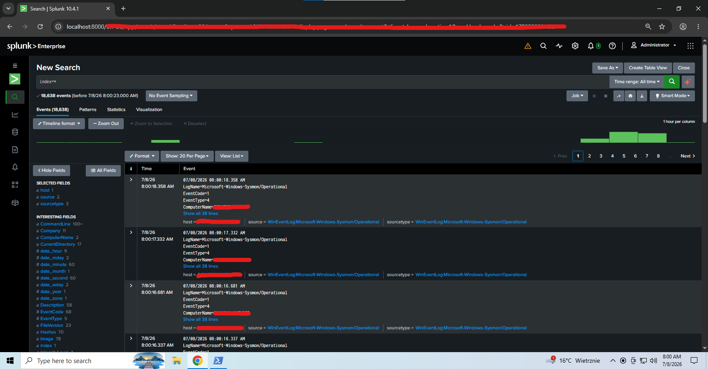
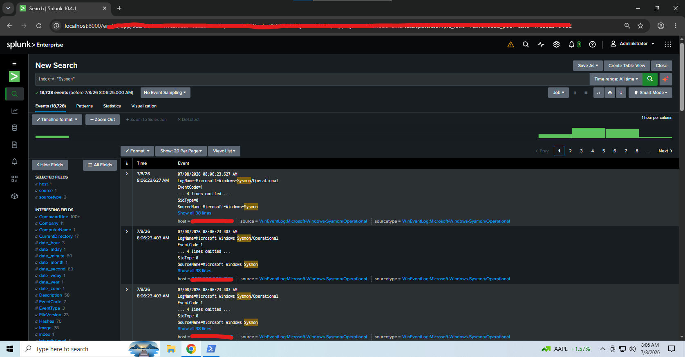
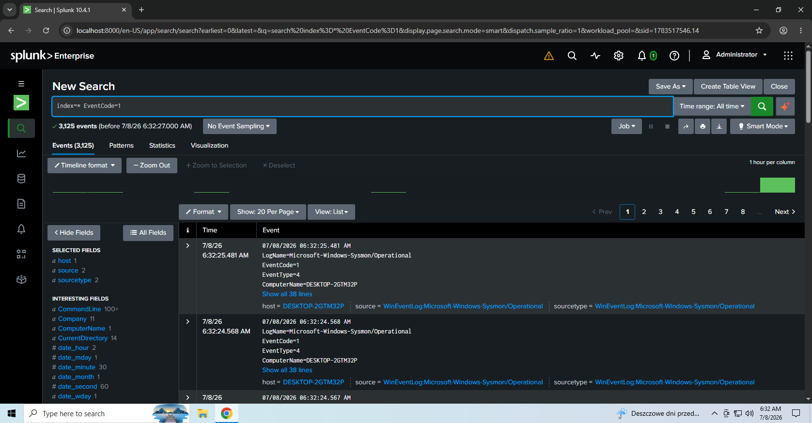
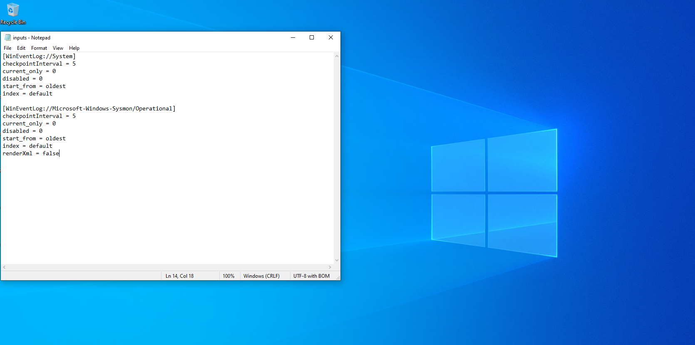
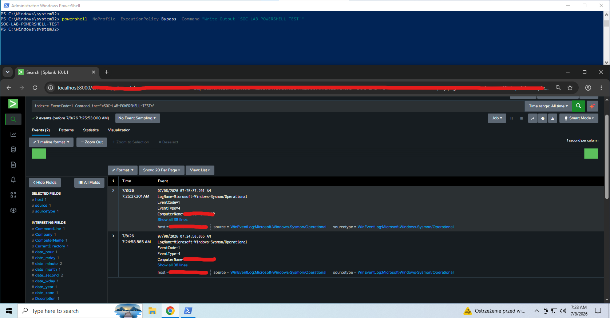

# Splunk SOC Lab

Home SOC lab project built to demonstrate basic SOC analyst skills using Splunk, Windows Event Logs, and Sysmon.

## Objective

The goal of this lab is to collect Windows security and Sysmon logs, search them with SPL, and document simple investigation workflows for common SOC alerts.

## Skills Demonstrated

- SIEM monitoring
- Alert triage
- Windows Event Log analysis
- Sysmon event analysis
- Basic threat detection
- Incident investigation documentation
- PowerShell process detection
- Splunk input configuration

## Lab Environment

| Component | Purpose |
|---|---|
| Windows 10 VM | Endpoint generating logs |
| Sysmon | Enhanced endpoint telemetry |
| Splunk Enterprise | SIEM platform for local log ingestion and searching |
| Windows Event Logs | Native Windows log source |
| PowerShell | Test process used to generate detectable activity |

## Detection Use Cases

1. Failed login attempts
2. Suspicious PowerShell execution
3. Sysmon process creation monitoring
4. Sysmon network connection monitoring
5. Brute-force investigation workflow
6. Local Windows/Sysmon log ingestion through Splunk inputs configuration

## Example SPL Queries

Search all indexed events:

```spl
index=*
```

Search Sysmon-related events:

```spl
index=* "Sysmon"
```

Search Sysmon process creation activity:

```spl
index=* "Process Create"
```

Search Sysmon Event ID 1:

```spl
index=* EventCode=1
```

Search Sysmon Operational log source:

```spl
source="WinEventLog:Microsoft-Windows-Sysmon/Operational"
```

Search PowerShell process creation events:

```spl
index=* EventCode=1 CommandLine="*powershell*"
```

Search a specific PowerShell test command:

```spl
index=* EventCode=1 CommandLine="*SOC-LAB-POWERSHELL-TEST*"
```

## Lab Evidence

This lab was built on a Windows 10 virtual machine using Splunk Enterprise and Sysmon.

Evidence collected:

- Splunk successfully indexed Windows Sysmon Operational logs.
- `index=*` returned over 7,000 events from the lab environment.
- Sysmon-related searches returned over 6,000 events.
- Process Create activity was identified using Sysmon Event ID 1.
- A PowerShell test command was executed in the Windows 10 VM and detected in Splunk using Sysmon process creation logs.
- Local Splunk input configuration was documented through `inputs.conf`.

## Screenshots

### All Indexed Events

This screenshot shows that Splunk successfully indexed events from the lab environment.



### Sysmon Events

This screenshot shows Sysmon Operational logs collected and searchable in Splunk.



### Sysmon Process Create Events

This screenshot shows Sysmon process creation activity, including Event ID 1 / Process Create events.



### Splunk Inputs Configuration

This screenshot shows the local Splunk input configuration used to collect Windows System logs and Sysmon Operational logs.



### PowerShell Command Detection

This screenshot shows a PowerShell command executed in the Windows 10 VM and detected in Splunk through Sysmon Event ID 1 process creation logs.



## Repository Structure

```text
splunk-soc-lab/
├── README.md
├── spl-queries/
│   ├── failed_logins_4625.spl
│   ├── suspicious_powershell.spl
│   ├── sysmon_process_creation.spl
│   └── sysmon_network_connections.spl
├── investigation-notes/
│   └── brute-force-investigation.md
├── configs/
│   └── inputs.conf
├── dashboards/
│   └── dashboard-notes.md
└── screenshots/
    ├── splunk-all-events.png
    ├── splunk-sysmon-events.png
    ├── splunk-process-create-events.png
    ├── splunk-inputs-config.png
    └── powershell-command-detection.png
```

## Notes

This project uses a home lab environment. No real company data, customer data, or sensitive logs are included.

Sensitive lab identifiers such as hostname, computer name, username, and IP addresses were removed or redacted from screenshots where needed.
This project uses a home lab environment. No real company data, customer data, or sensitive logs are included.

Sensitive lab identifiers such as hostname, computer name, username, and IP addresses were removed or redacted from screenshots where needed.
